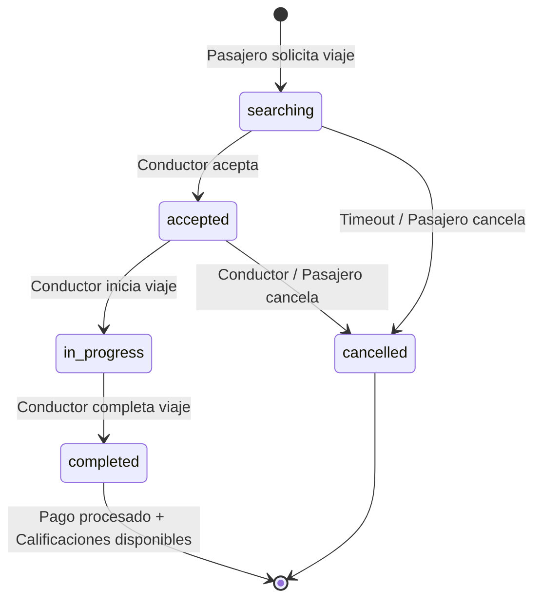

# 📋 Casos de Uso — MotoTaxi

## Actores del Sistema

| Actor | Descripción |
|---|---|
| **Pasajero** | Usuario que solicita viajes, realiza pagos y califica conductores |
| **Conductor** | Usuario que acepta viajes, comparte ubicación y califica pasajeros |
| **Sistema** | API Gateway + Microservicios (procesamiento automatizado) |
| **Admin** | Dashboard de gestión (futuro) |

---

## Diagrama de Casos de Uso

```mermaid
flowchart TD
    P(["👤 Pasajero"])
    D(["🏍️ Conductor"])
    S(["⚙️ Sistema"])

    subgraph UC_AUTH ["🔐 Gestión de Acceso (auth-service)"]
        UC1["Registrarse"]
        UC2["Iniciar Sesión"]
        UC3["Ver/Editar Perfil"]
        UC4["Cerrar Sesión"]
    end

    subgraph UC_RIDE ["🚗 Gestión de Viajes (rides-service)"]
        UC5["Solicitar Viaje"]
        UC6["Ver Viajes Disponibles"]
        UC7["Aceptar Viaje"]
        UC8["Iniciar Viaje"]
        UC9["Completar Viaje"]
        UC10["Cancelar Viaje"]
        UC11["Ver Historial de Viajes"]
    end

    subgraph UC_TRACK ["📍 Tracking en Tiempo Real (tracking-service + Redis)"]
        UC12["Compartir Ubicación GPS"]
        UC13["Ver Conductor en Mapa"]
        UC14["Enviar Mensaje de Chat"]
        UC15["Activar Emergencia"]
    end

    subgraph UC_PAY ["💳 Pagos (payments-service)"]
        UC16["Agregar Método de Pago"]
        UC17["Recargar Wallet"]
        UC18["Realizar Pago de Viaje"]
        UC19["Ver Historial de Pagos"]
    end

    subgraph UC_RATE ["⭐ Calificaciones (ratings-service + MongoDB)"]
        UC20["Calificar Conductor"]
        UC21["Calificar Pasajero"]
        UC22["Ver Calificaciones Recibidas"]
    end

    %% Pasajero
    P --> UC1 & UC2 & UC3 & UC4
    P --> UC5 & UC10 & UC11
    P --> UC13 & UC14 & UC15
    P --> UC16 & UC17 & UC18 & UC19
    P --> UC20 & UC22

    %% Conductor
    D --> UC1 & UC2 & UC3 & UC4
    D --> UC6 & UC7 & UC8 & UC9 & UC10 & UC11
    D --> UC12 & UC14 & UC15
    D --> UC19 & UC22
    D --> UC21

    %% Sistema
    S --> UC18
    S -.->|"JWT Validation"| UC2
    S -.->|"WebSocket"| UC12
    S -.->|"WebSocket"| UC13
```

---

## Descripción de Casos de Uso Principales

### UC5 — Solicitar Viaje

| Campo | Detalle |
|---|---|
| **Actor principal** | Pasajero |
| **Precondición** | Sesión activa con JWT válido |
| **Flujo principal** | 1. Pasajero ingresa origen y destino → 2. Sistema calcula precio estimado → 3. Pasajero confirma → 4. Sistema publica viaje disponible → 5. Conductores reciben notificación vía WebSocket |
| **Flujo alternativo** | Sin conductores disponibles → Sistema notifica y permite reintentar |
| **Postcondición** | Viaje creado con estado `searching` en `mototaxi_rides` |
| **Microservicio** | `rides-service` + `tracking-service` (WebSocket) |

---

### UC7 — Aceptar Viaje

| Campo | Detalle |
|---|---|
| **Actor principal** | Conductor |
| **Precondición** | Conductor en línea con ubicación compartida |
| **Flujo principal** | 1. Conductor ve viaje disponible → 2. Acepta → 3. Sistema actualiza estado a `accepted` → 4. Pasajero recibe notificación → 5. GPS del conductor visible para pasajero |
| **Postcondición** | Estado `accepted`, pasajero recibe socketEvent `rideAccepted` |
| **Microservicio** | `rides-service` + `tracking-service` (WebSocket) |

---

### UC18 — Realizar Pago de Viaje

| Campo | Detalle |
|---|---|
| **Actor principal** | Sistema (automático al completar viaje) |
| **Flujo principal** | 1. Viaje completado → 2. `rides-service` notifica a `payments-service` → 3. Payments procesa cobro según método → 4. Registra transacción → 5. Actualiza wallet si aplica |
| **Microservicio** | `payments-service` → `mototaxi_payments` (MySQL) |

---

## Ciclo de Vida de un Viaje

