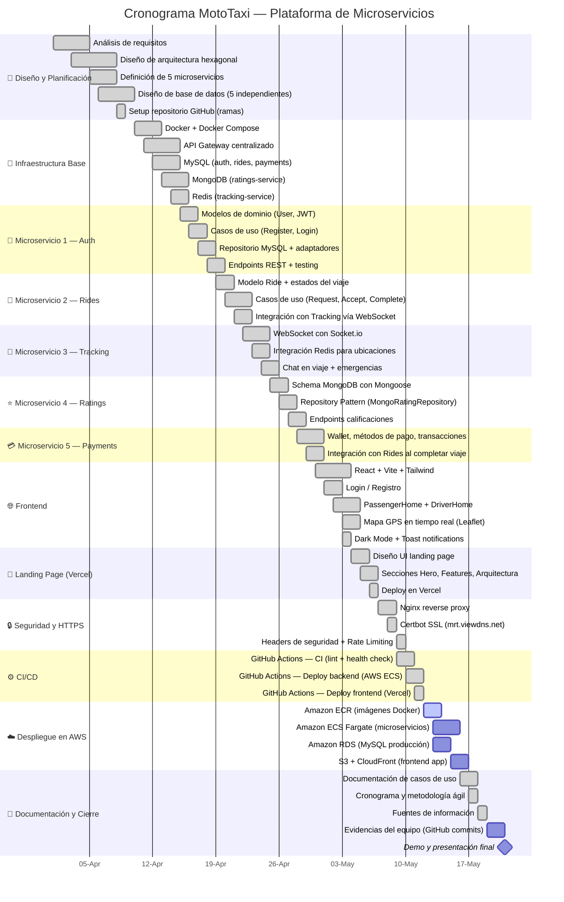

# 📅 Cronograma de Actividades — MotoTaxi

## Resumen del Proyecto

| Campo | Detalle |
|---|---|
| **Duración total** | 8 semanas (2 meses) |
| **Metodología** | Scrum — Sprints de 2 semanas |
| **Inicio** | Abril 2026 |
| **Cierre** | Mayo 2026 |

---

## Diagrama de Gantt

---

## Hitos Clave

| Hito | Fecha | Estado |
|---|---|---|
| ✅ Arquitectura definida | 08 Abr 2026 | Completado |
| ✅ 5 Microservicios operativos localmente | 29 Abr 2026 | Completado |
| ✅ Frontend funcional con Login/Dashboard | 03 May 2026 | Completado |
| ✅ CI/CD con GitHub Actions | 11 May 2026 | Completado |
| 🔄 Despliegue en AWS ECS | 15 May 2026 | En progreso |
| ⬜ Demo y presentación final | 21 May 2026 | Pendiente |
