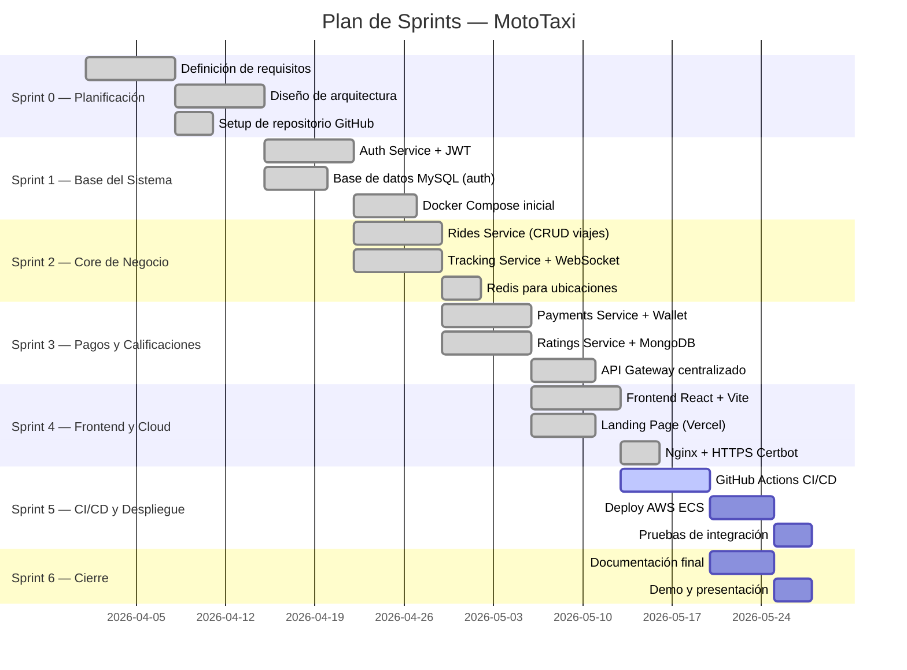

# ⚡ Metodología Ágil — MotoTaxi

## Metodología Aplicada: **SCRUM**

El desarrollo de MotoTaxi siguió la metodología **Scrum** adaptada a equipos académicos, con sprints de 2 semanas, revisiones de código vía Pull Requests en GitHub y entregas incrementales.

---

## Roles del Equipo

| Rol Scrum | Responsabilidad |
|---|---|
| **Product Owner** | Define el backlog, prioriza funcionalidades, valida entregables |
| **Scrum Master** | Facilita ceremonias, remueve impedimentos, garantiza el proceso |
| **Dev Team** | Diseño, desarrollo e integración de microservicios y frontend |

---

## Sprints del Proyecto



---

## Ceremonias Scrum

| Ceremonia | Frecuencia | Duración | Descripción |
|---|---|---|---|
| **Sprint Planning** | Inicio de cada sprint | 1 hora | Selección de ítems del backlog y asignación |
| **Daily Standup** | Diario | 15 min | ¿Qué hice? ¿Qué haré? ¿Bloqueos? |
| **Sprint Review** | Fin de cada sprint | 30 min | Demo de lo entregado al Product Owner |
| **Sprint Retrospective** | Fin de cada sprint | 30 min | ¿Qué mejorar en el próximo sprint? |

---

## Product Backlog (User Stories priorizadas)

| ID | Prioridad | Historia de Usuario | Estado |
|---|---|---|---|
| US-01 | 🔴 Alta | Como pasajero, quiero registrarme y hacer login | ✅ Done |
| US-02 | 🔴 Alta | Como pasajero, quiero solicitar un viaje | ✅ Done |
| US-03 | 🔴 Alta | Como conductor, quiero aceptar y gestionar viajes | ✅ Done |
| US-04 | 🔴 Alta | Como usuario, quiero ver la ubicación en tiempo real | ✅ Done |
| US-05 | 🟡 Media | Como pasajero, quiero pagar digitalmente | ✅ Done |
| US-06 | 🟡 Media | Como usuario, quiero calificar al otro participante | ✅ Done |
| US-07 | 🟡 Media | Como usuario, quiero chatear durante el viaje | ✅ Done |
| US-08 | 🟡 Media | Como pasajero, quiero activar emergencia | ✅ Done |
| US-09 | 🟠 Baja  | Como usuario, quiero modo oscuro | ✅ Done |
| US-10 | 🟠 Baja  | Como admin, quiero ver métricas del sistema | 🔄 En progreso |

---

## Flujo de Trabajo GitHub

```
main ←── develop ←── feature/us-01-auth
                ←── feature/us-02-rides
                ←── feature/us-05-payments
                ←── hotfix/fix-jwt-expiry
```

- **`main`**: código en producción (protegida, requiere PR aprobado)
- **`develop`**: integración continua de features
- **`feature/*`**: desarrollo de cada User Story
- **`hotfix/*`**: correcciones urgentes en producción

### Reglas de Merge
1. Todo cambio pasa por **Pull Request**
2. Requiere revisión de al menos **1 miembro del equipo**
3. CI debe estar en verde (GitHub Actions)
4. Se hace squash merge para mantener historial limpio
